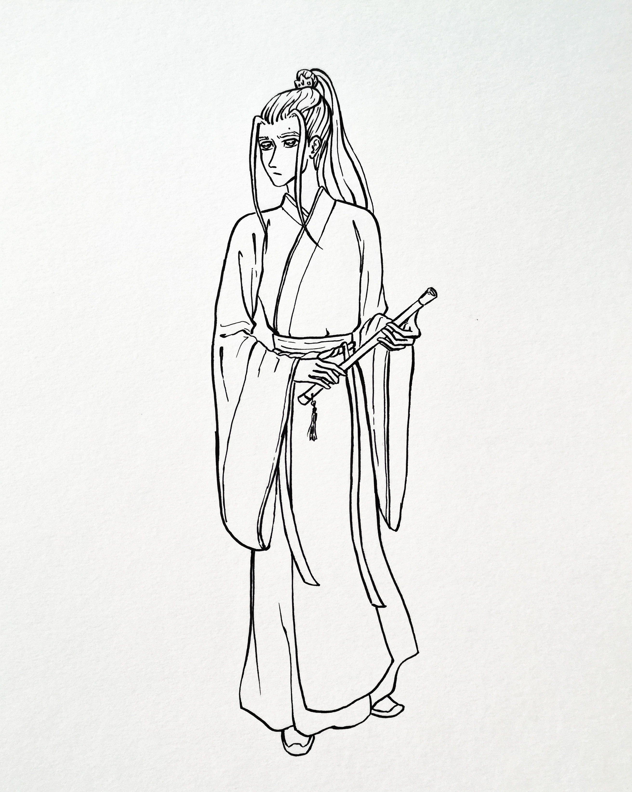
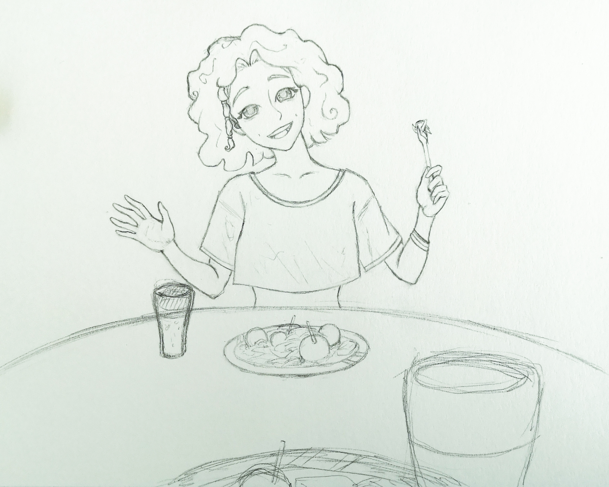

## Portfolio

---

### Done projects 

[Piratiska Riba](/https://krugisa.itch.io/piratiska-riba)

 
Worked on a level design for both islands using Unity engine and 3D assets.
 

---

---
[Artwork & sketches](http://example.com/)

---
---

### Projects in workshop

- [Visual novel project](https://github.com/Izvanzemaljac/izvanzemaljac.github.io/blob/master/images/Wall_shasha4.png)

 
Working on a Visual novel game. Programing in Unity with NaniNovel extension. Organizing storyline with choiches on Draw.io.
<link rel="aknjeoaheswnoajusbdhotfiausditfb" href="https://fonts.googleapis.com">
 

---

---

<!-- Remove above link if you don't want to attibute; JESAM! 
  testic testiccccccccc
 -->
